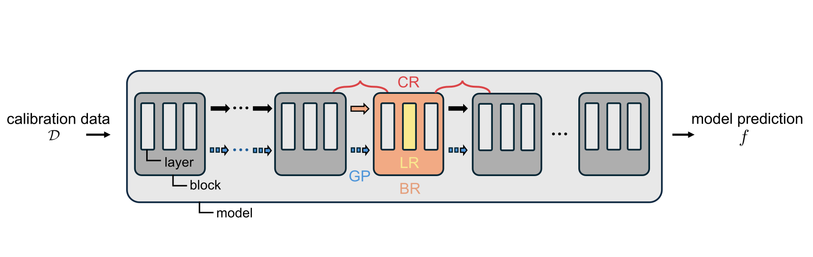
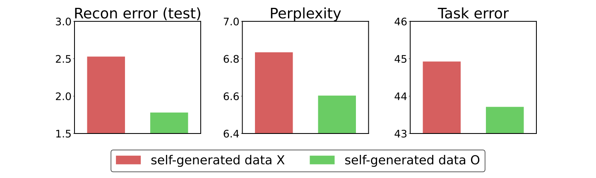

# Rethinking Pruning Large Language Models: Benefits and Pitfalls of Reconstruction Error Minimization

This repository contains PyTorch source code for EMNLP 2024 paper [Rethinking Pruning Large Language Models: Benefits and Pitfalls of Reconstruction Error Minimization](https://arxiv.org/abs/2406.15524), compatible with [Intel Gaudi2](https://www.intel.com/content/www/us/en/developer/platform/gaudi/overview.html) Accelerator.

Our implementation is based on [EBFT](https://github.com/sunggo/EBFT/tree/main), [Wanda](https://github.com/locuslab/wanda), [SparseGPT](https://github.com/IST-DASLab/sparsegpt), and [LLM-QAT](https://github.com/facebookresearch/LLM-QAT).

## Abstract


This work suggests fundamentally rethinking
the current practice of pruning large language
models (LLMs). The way it is done is by divide and conquer: split the model into submodels, sequentially prune them, and reconstruct
predictions of the dense counterparts on small
calibration data one at a time; the final model is
obtained simply by putting the resulting sparse
submodels together. While this approach enables pruning under memory constraints, it generates high reconstruction errors. In this work,
we first present an array of reconstruction techniques that can significantly reduce this error
by more than 90%. Unwittingly, however, we
discover that minimizing reconstruction error
is not always ideal and can overfit the given
calibration data, resulting in rather increased
language perplexity and poor performance at
downstream tasks. We find out that a strategy
of self-generating calibration data can mitigate
this trade-off between reconstruction and generalization, suggesting new directions in the
presence of both benefits and pitfalls of reconstruction for pruning LLMs.


<!--  -->


## Environments

### Docker
Used container image distributed from [Intel Gaudi Vault](https://developer.habana.ai/catalog/pytorch-container/)

```bash
docker pull vault.habana.ai/gaudi-docker/1.18.0/ubuntu22.04/habanalabs/pytorch-installer-2.4.0:latest
```

- Pytorch version : PyTorch 2.4.0

- Intel Gaudi Software : 1.18.0 

- OS : Ubuntu 22.04


### Python
- python 3.10

### Dependencies
```bash
pip install -r requirements.txt
```
## Usage

Make sure to export following environmental variables before running experiments

```bash
export HF_DATASETS_TRUST_REMOTE_CODE=1
export PT_HPU_LAZY_MODE=0 
export PT_HPU_GPU_MIGRATION=1
```

### Basic usage (for LLaMA)
LR
```bash
python main.py --config=./configs/llama.py
```

LR + GP
```bash
python main.py --config=./configs/llama.py --config.use_gp=True
```

LR + GP + CR
```bash
python main.py --config=./configs/llama.py --config.use_gp=True --config.use_cr=True
```

### OPT model

```bash
python main.py --config=./configs/opt.py
```

### Self-generated data
First, generate the data as follows.
```bash
python generate_data.py --config=./configs/data.py
```

Then, set config.self_nsamples to be a positive number.
```bash
python main.py --config=./configs/llama.py --config.self_nsamples=256
```

### Zero-shot performance evaluation

First, download the directory from the [link](https://drive.google.com/file/d/1zugbLyGZKsH1L19L9biHLfaGGFnEc7XL/view) provided from the Wanda repository.
Next, change the directory name to lm_eval.
Then, set config.eval_zero_shot as True.
```bash
python main.py --config=./configs/llama.py --config.eval_zero_shot=True
```

## Acknowledgements
- This implementation was supported in part by the NAVER-Intel Co-Lab.
